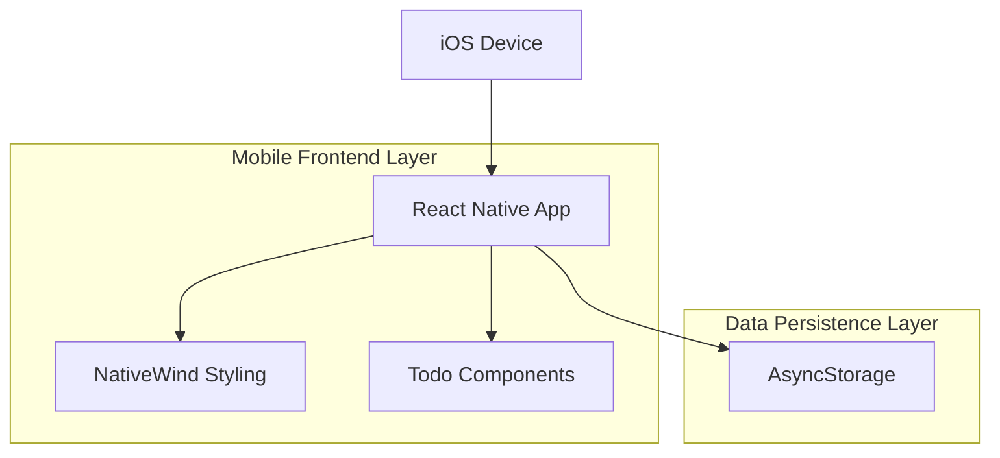
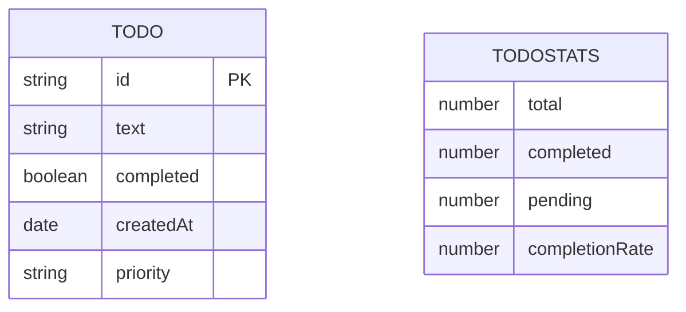

## 1.Architecture design



## 2.Technology Description

- Frontend: React Native + NativeWind (Tailwind CSS for React Native)
- Initialization Tool: Expo CLI
- Backend: None (local storage)
- Data Persistence: AsyncStorage
- Platform: iOS

## 3.Route definitions

| Route | Purpose |
|-------|---------|
| / | Main Todo screen with list and stats |
| /add | Add new todo item screen |
| /edit/:id | Edit existing todo item screen |

## 4.API definitions

### 4.1 AsyncStorage API

```typescript
//TodoItem type
type Todo = {
  id: string;
  text: string;
  completed: boolean;
  createdAt: Date;
  priority: 'low' | 'medium' | 'high';
};

//storage seys
const STORAGE_KEYS = {
  TODOS: '@todos',
  STATS: '@todo_stats'
};

//stats type
type TodoStats = {
  total: number;
  completed: number;
  pending: number;
  completionRate: number;
};
```

## 5.Server architecture diagram

N/A - This is a client-only mobile application with local storage.

## 6.Data model

### 6.1 Data model definition



### 6.2 Data Definition Language

N/A - Data is stored locally using AsyncStorage key-value pairs rather than a relational database.